# API BANCO (v1.0)

Api creado para registro de tipo de cambio, H2 para BD, CRUD JPA, documentación Springdoc, control de excepciones y JWT.

## Requisitos previos
* Spring Boot v3.2.0
* Spring Data JPA v3.2.0
* Spring Boot Web v3.2.0
* Spring Security v6.2.0
* Spring Doc Web MVC v2.2.0
* H2 Database v2.2.224
* Lombok v1.18.30
* Hibernate v6.0.6
* Maven v3.2.0
* Json Web Token (API, IMPL, JACKSON) v0.11.5
* Swagger Core v3 - jakarta v2.2.15

## Instalación

1. Abrir con su ID preferido e instalar las dependencias.
2. Al ejecutar el proyecto, ingresar a un navegador a la siguiente ruta: 
   ```
    http://localhost:8090/swagger-ui/index.html
   ```
    
   - La manipulación de los datos se puede realizar por el mismo Swagger:

       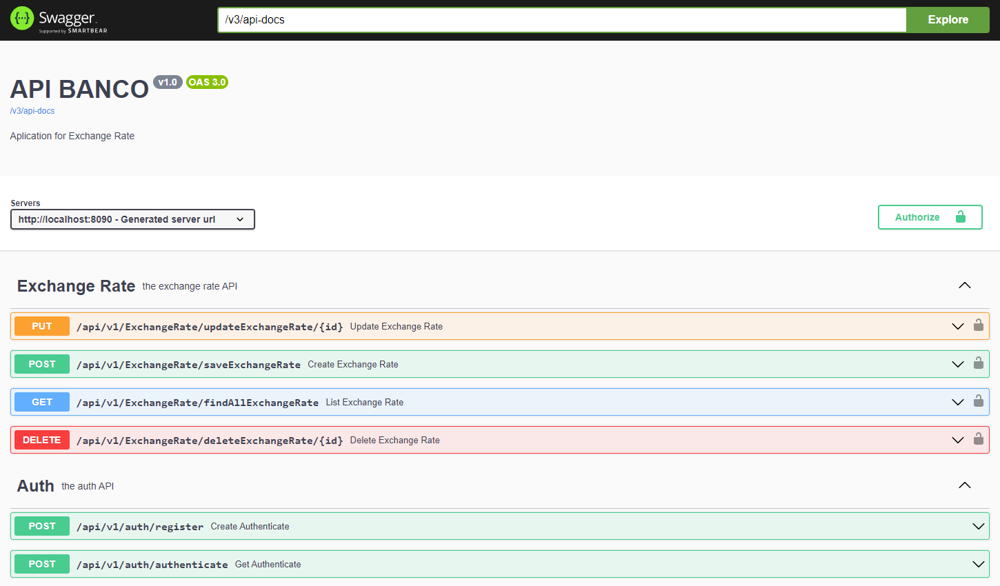

   - Tambíen se puede realizar por Postman o SoapUI.

       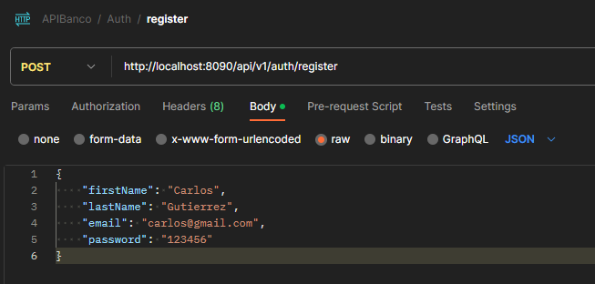

3. Primero se debe crear un usuario, para poder asi desbloquear los métodos CRUD del Exchange Rate:

    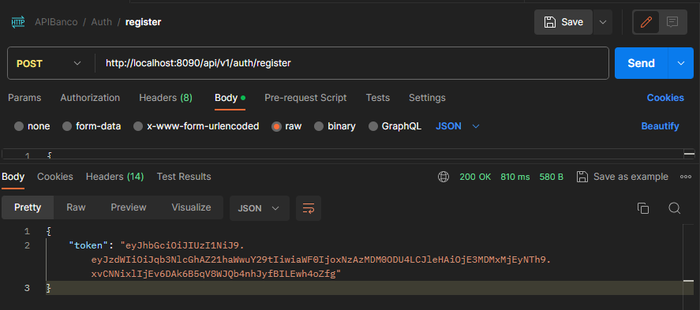

    **Ejemplo de código para crear un nuevo usuario**
    ```
       {
       "firstName": "Carlos",
       "lastName": "Gutierrez",
       "email": "carlos@gmail.com",
       "password": "123456"
       }
    ```
6. Luego ingresar el Token JWT del resultado, en Authorization (Bearer Token), luego pegar el token en el input:

    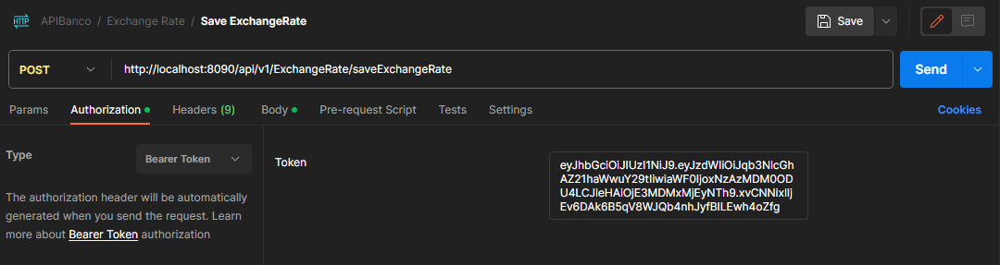
    
    - Para el caso de Swagger Web, generar el token por el método (**/api/v1/auth/register**), y Execute:
      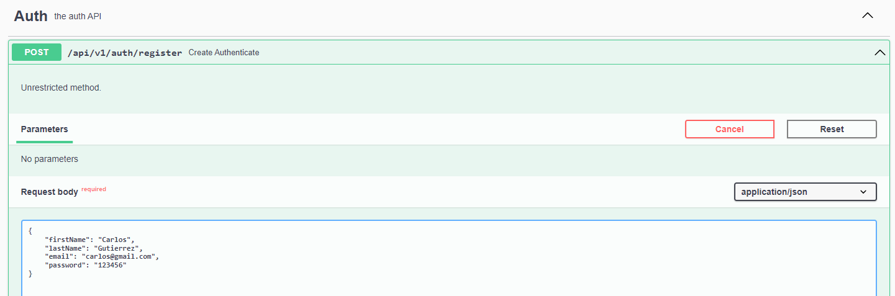
    - Cuando devuelva el token, copiarlo para luego pegarlo en la parte superior (botón -> Authorize):
      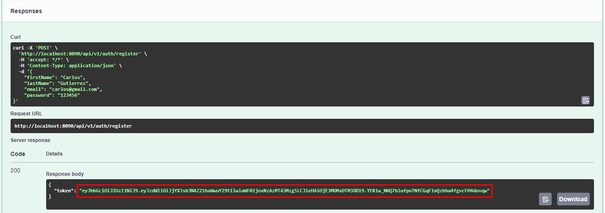
    - Pegar el token, y luego en Authorize:
      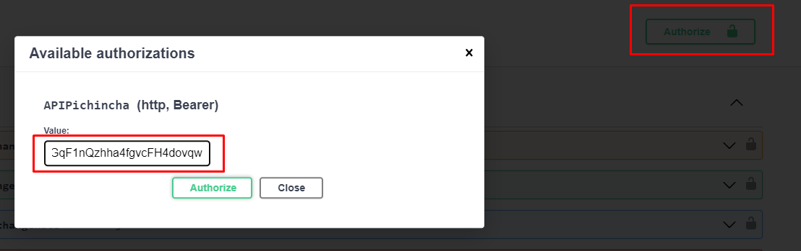
    - Luego de esos los candados estarán listos para usar los métodos de Exchange Rate:
      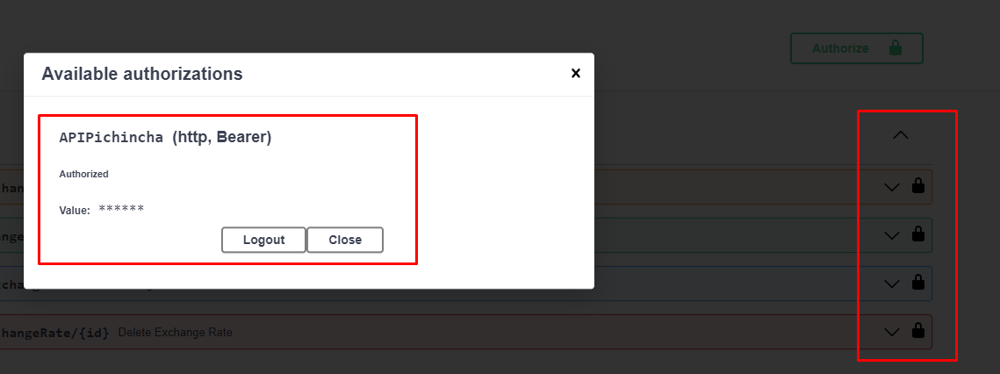
    - Cerrar el pop-pup y efectivamente ya se encuentran desbloquados y listos para usar:
      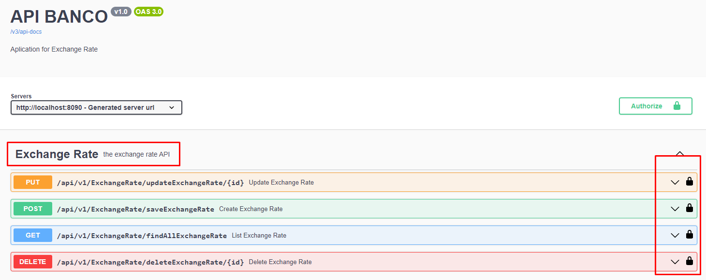

## Uso

### Auth (the auth API)
- Json creación de usuario:
    ````
    *** METHOD: POST ***
    URL: http://localhost:8090/api/v1/auth/register
    ````
    ````
    {
       "firstName": "Carlos",
       "lastName": "Gutierrez",
       "email": "carlos@gmail.com",
       "password": "123456"
    }
    ````
- Json consulta de usuario
    ````
    *** METHOD: POST ***
    URL: http://localhost:8085/api/auth/authenticate
    ````
    ````
    {
       "email": "carlos@gmail.com",
       "password": "123456"
    }
    ````
### Exchange Rate (the exchange rate API)
- Json para guardar tipo de cambio:
    ````
    *** METHOD: POST ***
    URL: http://localhost:8090/api/v1/ExchangeRate/saveExchangeRate
    ````
    ````
    {
        "sourceCurrency": "SOL",
        "targetCurrency": "EUR",
        "rate": 4.20
    }
    ````
- Json para actualizar tipo de cambio:
    ````
    *** METHOD: PUT ***
    URL: http://localhost:8090/api/v1/ExchangeRate/updateExchangeRate/1
    ````
    ````
    {
        "sourceCurrency": "SOL",
        "targetCurrency": "DOL",
        "rate": 3.95
    }
    ````
- Para eliminar tipo de cambio, solo agregar en la URL la siguiente expresión (**api/v1/ExchangeRate/deleteExchangeRate/1**)
    ````
    *** METHOD: DELETE ***
    URL: http://localhost:8090/api/v1/ExchangeRate/deleteExchangeRate/1
    ````
  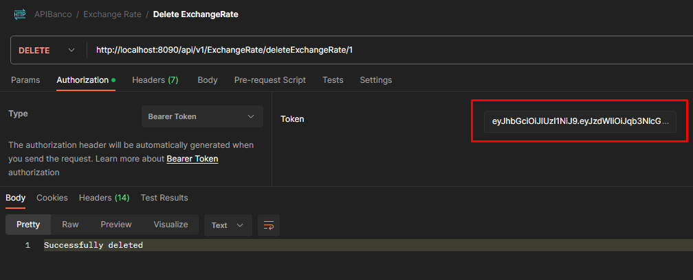
- Para listar los tipos de cambio, solo agregar en la URL la siguiente expresión (**api/v1/ExchangeRate/findAllExchangeRate**)
    ````
    *** METHOD: GET ***
    URL: http://localhost:8090/api/v1/ExchangeRate/findAllExchangeRate
    ````
  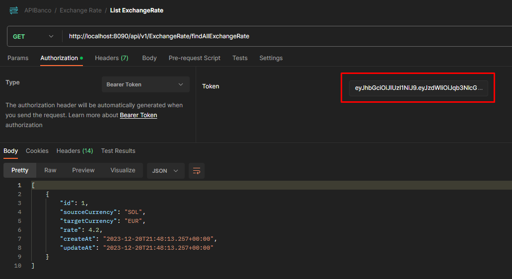

## Recomendaciones

- El aplicativo aun esta en desarrollo, se sigue implementando nuevas librerías y actualizaciones.
- No olvidar que cada peticion se debe agregar el JWT para que pueda funcionar los métodos.
